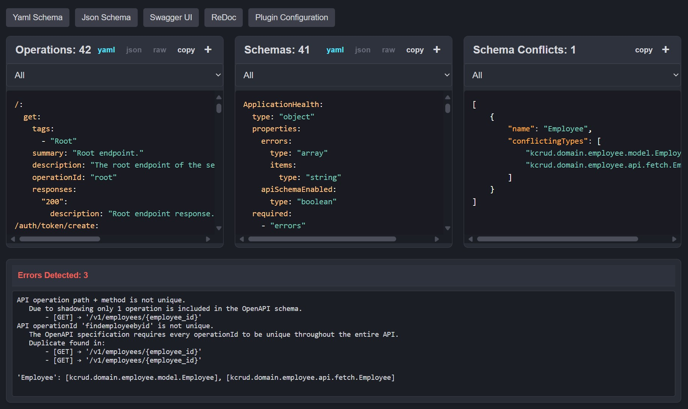

## Debug Panel

The debug panel is an access point to view information gathered by the plugin,
the generated `YAML` or `JSON` OpenAPI schemas, in addition of quick access to Swagger-UI and ReDoc.

---

---

Although Kopapi does not perform full validation of the schema, it does provide some error logs
to help you identify potential issues.

---

### [Internals - Type Conflicts 🡲](02-type-conflicts.md)

#### [🡰 Schema Annotation](../02-api-usage/09-schema-annotation.md)
