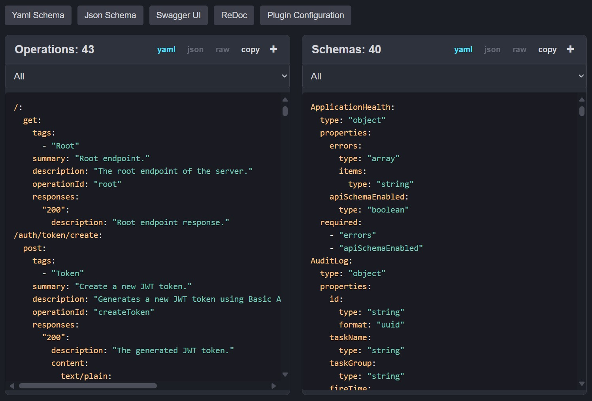

## Debug Panel

The debug panel is an access point to view information gathered by the plugin,
the generated `YAML` or `JSON` OpenAPI schemas, in addition of quick access to Swagger-UI and ReDoc.

---

---

### [Internals - Type Conflicts 🡲](03.1.internals-type-conflicts.md)

#### [🡰 Attributes](02.7.api-usage-attributes.md)
