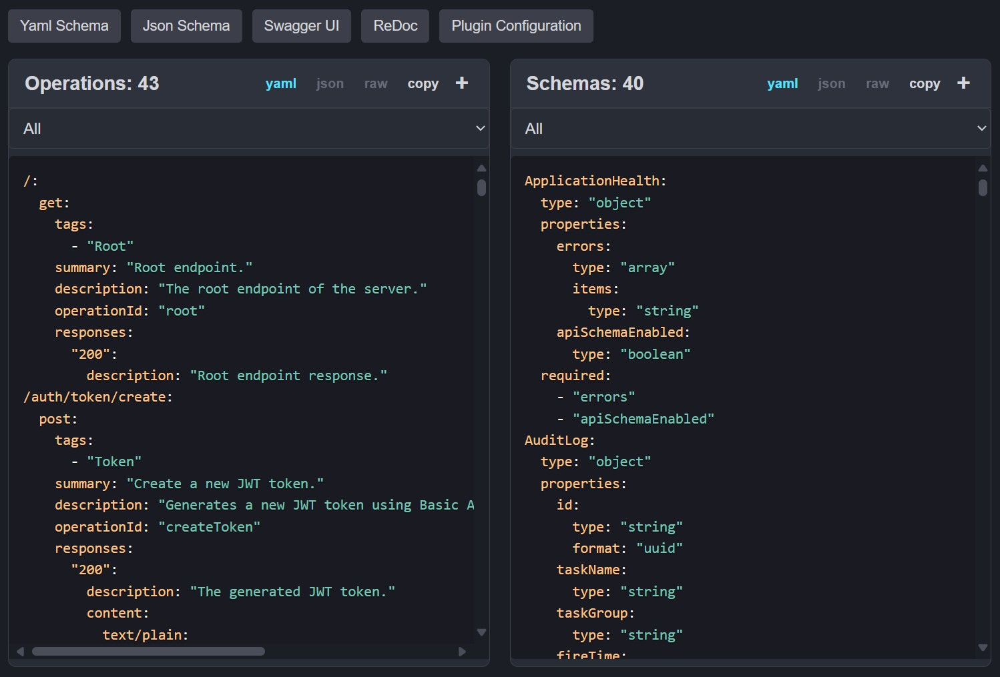

## Debug Panel

The debug panel is a feature that helps identify issues with the Schema generation.
It is a simple `HTML` page that displays the `DSL` information gathered by the plugin,
in its raw form before it is transformed into the OpenAPI specification.

---

---

### [🡰 Type Introspection](04.type-introspection.md)
